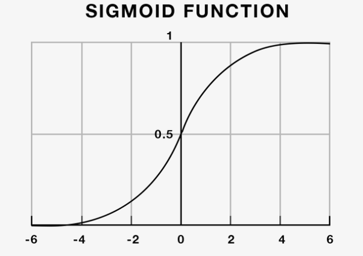
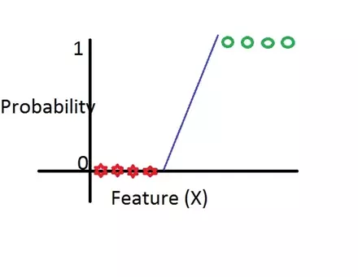
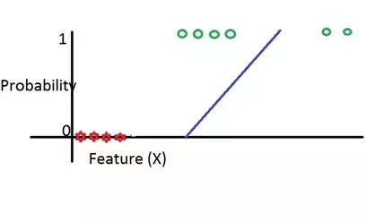

假设你在逛街时，看到周志华老师在买西瓜。他在一个色泽乌黑，敲声沉闷而且根蒂硬挺的瓜面前饶有兴趣地看着，这时你会很好奇，周老师会不会买下这个瓜呢？如果不能确定，那么你如何直到他有多大概率会买下这个瓜呢？

要想解决这个问题，我们就需要用到所谓的**logistic regression**了。

## 两个小概念
### logistic fuction
logistic 模型起源于19世纪，起因是为了找到人口的增长模型，也就是一个人口数关于时间t的增长函数W(t)。而更为重要的是，要找到人口增长速率，也就是其导数$W'(t)$。最简单的猜想就是，该速率为W(t)的常数倍，用公式表示为：

$W'(t) = {\beta}W(t)$

其中，$W'(t)$为人口增长速率，$\beta$为一个常数。这种函数最常见的就是指数函数了，于是W(t)可以表示为：

$W(t) = Ae^{(\beta t)}$

这就是早期的人口增长模型。但是人们发现这样的速率增长下去，人口很快就会爆炸式增长，上面这个公式只能在人口基数很小的时候进行。1840年，一个叫Verhulst 的比利时数学家提出，人口在增长到一定限度后，会逐渐放缓。他给原方程加上了一个阻碍因子，表现如下：

$W'(t) = {\beta}W(t)({\Omega - W(t)})$

这里$\Omega$代表饱和时的人数，经过解常微分方程可得到：

$W'(t) = {\frac{e^{\alpha+\beta t}}{1+e^{\alpha+\beta t}}}$

这就是我们所说的*logistic fuction*. 这里可能不同地方书写的形式不太一样，但是实质上都是等价的。

### logit
我们将上面的函数变换一下形式：

$logit(p) = ln{\frac{p}{1-p}}=\alpha+\beta t$

其中${\frac{p}{1-p}}$称作几率(Odds)。可以看到，逻辑回归就是通过将线性回归(右边部分)转化为对数几率（左边部分）来进行分类。因此，有些地方也称之为“对数几率回归”。

## 详解逻辑斯蒂回归
### 是什么
logistic regression是用于进行二元分类的分类模型，其输入不限，输出y$\in \{0,1\}$，可以在判断的同时输出分类为正类地概率。比如通过肿瘤大小判断是否是恶性肿瘤，该模型可得到在不同大小下得恶性肿瘤的概率，从而方便采取措施。先将原输入数据用线性函数表示：

$Z = \theta_{0}+\theta_{1}x_{1}+\theta_{2}x_{2}+\theta_{3}x_{3}+...+\theta_{n}x_{n}$

然后利用logistic函数将其转化为非线性模型：

$f(x) = \frac{1}{1+e^{-z}}$

从而得到如下曲线：

这里的纵坐标表示判断为正类的概率。这个模型也就是我们的逻辑斯蒂回归模型了。

### 为什么
经过上面的介绍，我们应该对逻辑斯蒂回归的作用方式有所了解了，但是可能大家会有疑问：为什么不能直接用线性模型呢？其实，对于此类二分类场景，不适合直接使用线性回归模型，原因有二：

1. 线性回归模型是通过输入X来判断y,直线的预测结果可能超出0和1，而这些点都不具有任何意义。

2. 对于异常点敏感，训练出的模型很难有好的效果。

因此，我们需要将其转换到非线性空间中，才会得到我们想要的结果。而相较于同样用于二分类的SVM，它也有两点优势：

1. 输出值具有概率意义，而不是仅仅进行分类。
2. 可以很方便推广到多类分类，而SVM想多类分类会麻烦很多。

所以，最终我们采用**logistic regression**进行二元分类工作，特别是这种概率具有实际意义的情景。

### 怎么训练
逻辑斯蒂回归采用**极大似然估计**的方法进行参数估计。估计过程如下：
设 P(Y=1|X) = p,P(y=0|X)=1-p,那么似然函数为：

$\prod^{N}_{i=1}p^{y_{i}}(1-p)^{1-y_{i}}$

取对数并结合前面的logit公式可求出：

$L(w)=\sum^{N}_{i=1}[y_{i}(wx)-log(1+e^{wx})]$

据此求出使L(w)为极大值的w的估计值即可，这样将该线性函数代入到原函数，就可以得到我们想要的模型。

在了解到这些之后，你就可以拿着周老师以前买瓜的记录数据，根据不同情况下他买还是没有买，训练逻辑斯蒂回归模型，最后输入{色泽=乌黑，敲声=沉闷,根蒂=硬挺}，就可以得到他又多大概率买下这个瓜啦。

## 总结
1. Logistic Regression主要用于二类分类，推广后也可用于多类分类。
2. 该模型的参数训练方式为利用极大似然函数的极限值，估计参数。

## 参考文献

[What is the Difference Between Logit and Probit Models?](https://www.methodsconsultants.com/tutorial/what-is-the-difference-between-logit-and-probit-models/)

[What is a Logistic Distribution?](https://www.statisticshowto.datasciencecentral.com/logistic-distribution/)

[李航，统计学习方法](https://www.amazon.cn/dp/B007TSFMTA)

[周志华，机器学习](https://www.amazon.cn/dp/B01ARKEV1G/ref=pd_lpo_sbs_14_t_0/458-4278779-0913747?_encoding=UTF8&psc=1&refRID=XC95PAB6TFYHT1BQRW7A)

[The Origins of Logistic Regression](https://papers.tinbergen.nl/02119.pdf)

[Quara: What is logistic regression?](https://www.quora.com/What-is-logistic-regression)